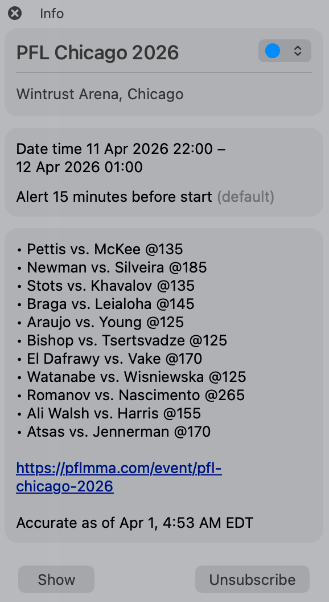

# pfl-cal

[Subscribe to this calendar to keep track of PFL events](https://openseabrus.github.io/pfl-cal/)

Or subscribe manually from your calendar app using this URL:

`webcal://raw.githubusercontent.com/openseabrus/pfl-cal/ics/PFL.ics`

## What is this?

A calendar feed that automatically adds PFL events to your calendar app of choice as each event gets announced and updated over time.

This feed is not affiliated with the PFL.

## Why is it better than other feeds?

The three biggest points that this aims to address, which I found lacking in other calendar feeds:

- **Always kept up to date**: events are added and card details are updated within a day of any changes posted on the source event listing, including new events, fight additions, or removals
- **Event times are accurate**: event times reflect your local timezone, and match the times shown on that listing
- **Card details**: without leaving your calendar, you can see every (announced) fight on the card, whether it's on the main card, prelims, or early prelims

## Example event

## Info for nerds

**How does it work?**

- Using a GitHub Action, the configured event site is scraped several times each day, and the `PFL.ics` file (from the URL above) is updated with any new information found

**To run locally:**

- Clone this repo, run the commands `npm install`, then `npm start`, and out spits your `PFL.ics` file with all the relevant events. The secondary feed `PFL-PPV.ics` is written alongside it.
- Run `npm run fetch` to log scraped upcoming events (and placeholders) without writing ICS files.
